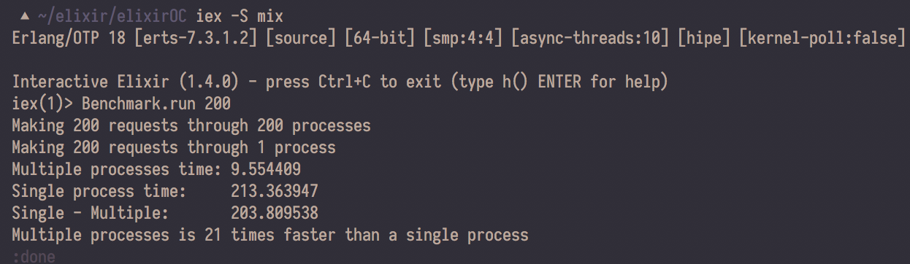

# ElixirOC

Just tinkering around with basic Elixir, Mix and Ottawa's OCTranspo's API for learning purposes.

To view the docs open 
```
doc/index.html
```

Running locally:
```
mix deps.get
touch config/dev.exs
touch config/test.exs
```

In your config/dev.exs and config/test.exs:
```
use Mix.Config

config :elixirOC, appID: "<OCTranspo appID>"
config :elixirOC, apikey: "<OCTranspo apikey>"
```

Example use:
```
iex -S mix
iex(1)> routes = [{3352, 80}, 3060]
[{3352, 80}, 3060]
iex(2)> ElixirOC.bus_routes_list(routes)
:ok
%{3060 => %{16 => "Britannia", 61 => "Terry Fox", 62 => "Stittsville",
    86 => "Baseline  Colonnade", 87 => "Baseline", 94 => "Millennium",
    95 => "Barrhaven Centre", 97 => "Bayshore", 98 => "Tunney's Pasture",
    107 => "South Keys", 403 => "Scotiabank Place", 750 => "Greenboro"},
  7659 => %{1 => "Ottawa-Rockcliffe"}}
```

Benchmark tests takes in an integer parameter (how many requests you want to make). Example:

